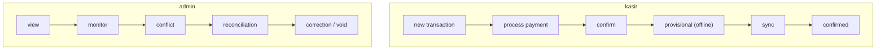
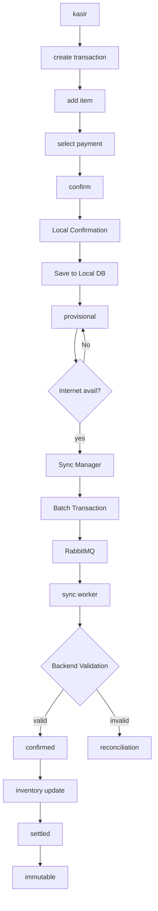
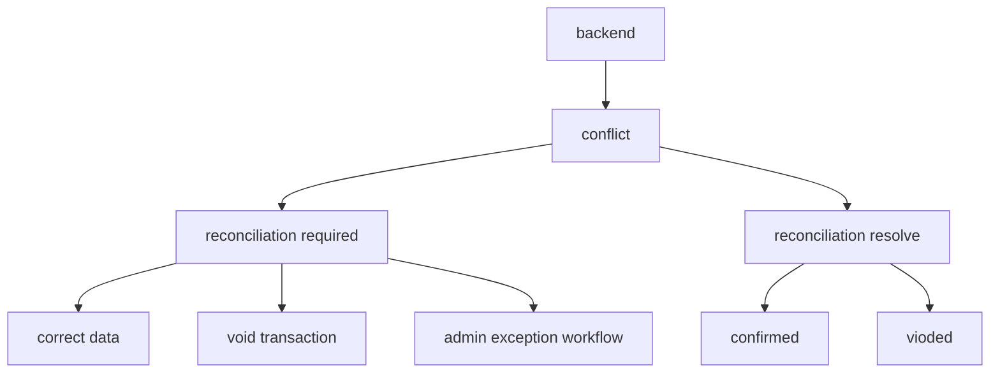
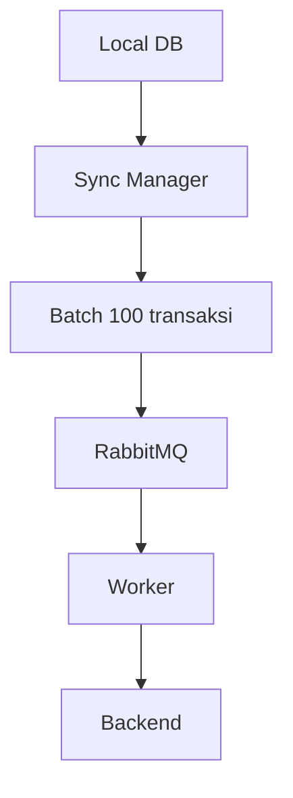
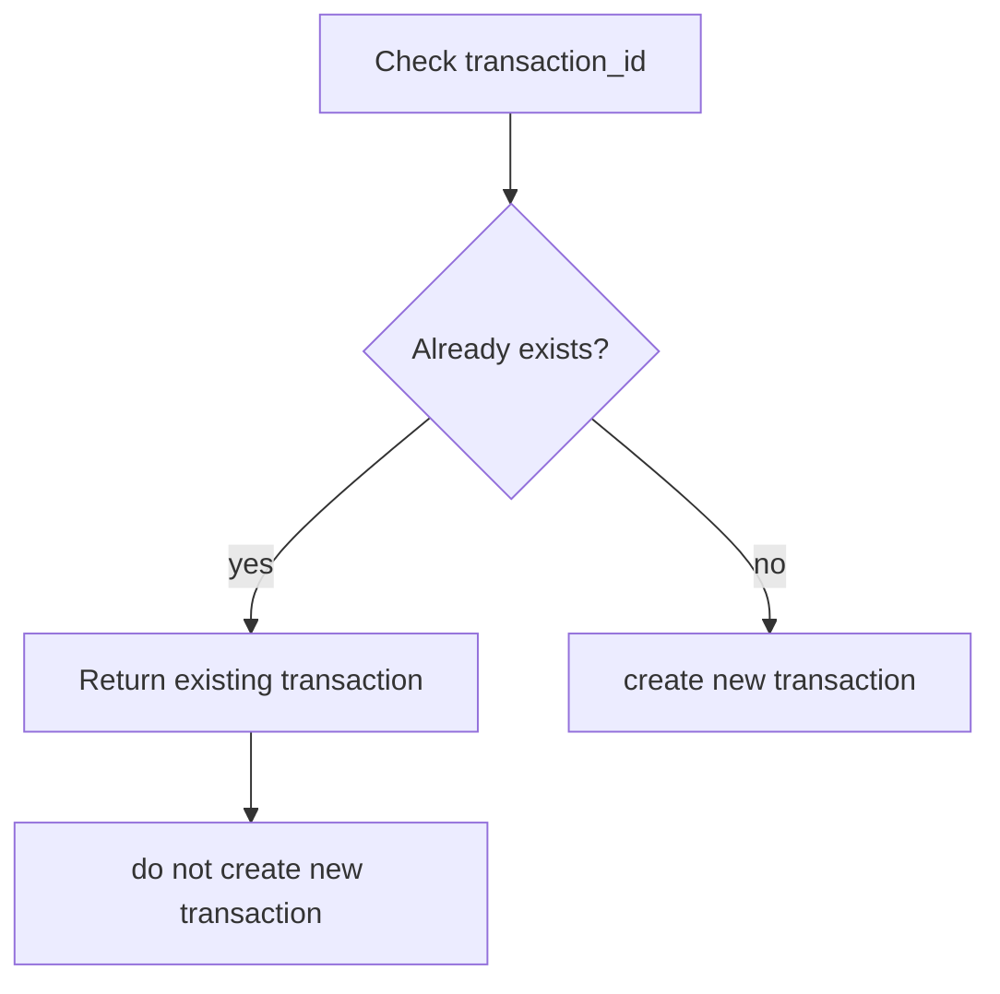

# 1. Functional Requirements Document (FRD)

K-POS memungkinkan Kasir tetap melakukan transaksi ketika koneksi internet tidak tersedia. Transaksi yang dibuat secara offline harus disimpan secara persisten pada perangkat, diberi status Provisional, dan kemudian disinkronisasikan ke backend ketika koneksi kembali tersedia.

Backend harus memastikan transaksi tidak hilang atau tercatat dua kali, mendukung transaksi dari beberapa perangkat secara bersamaan, serta menjaga transaksi yang sudah dikonfirmasi backend agar tidak dapat diubah oleh Operator (Kasir). Case study secara eksplisit menetapkan kebutuhan offline transaction creation, reliable synchronization, duplicate/lost transaction prevention, backend immutability, dan concurrent multi-device operation.

## a. User stories & use cases for each feature

### ➔ User stories

**1. Transaction management**
- **Membuat transaksi:** Sebagai Kasir, saya ingin membuat transaksi baru dengan memasukkan produk dan jumlah barang, sehingga saya dapat memproses pembelian pelanggan.
- **Melihat total transaksi:** Sebagai Kasir, saya ingin melihat daftar item, harga, jumlah, dan total transaksi sebelum melakukan konfirmasi, sehingga saya dapat memastikan transaksi sudah benar.
- **Memilih metode pembayaran:** Sebagai Kasir, saya ingin memilih metode pembayaran Cash, Static QRIS, atau Transfer, sehingga transaksi dapat diproses sesuai metode pembayaran pelanggan.

**2. Offline transaction**
- **Membuat transaksi ketika offline:** Sebagai Kasir, saya ingin tetap membuat transaksi ketika tidak ada koneksi internet, sehingga aktivitas penjualan tidak berhenti ketika terjadi gangguan jaringan.
- **Menyimpan transaksi secara lokal:** Sebagai Kasir, saya ingin transaksi offline tersimpan secara persisten pada perangkat, sehingga transaksi tidak hilang ketika aplikasi ditutup atau perangkat di restart.
- **Melihat status transaksi offline:** Sebagai Kasir, saya ingin mengetahui bahwa transaksi saya masih berstatus Provisional, sehingga saya dapat membedakannya dari transaksi yang sudah dikonfirmasi backend.

**3. Synchronization**
- **Mendeteksi koneksi kembali:** Sebagai Kasir, saya ingin sistem mendeteksi ketika koneksi internet kembali tersedia, sehingga transaksi Provisional dapat diproses untuk synchronization.
- **Melakukan synchronization:** Sebagai Kasir, saya ingin transaksi Provisional yang belum tersinkron dikirim ke backend ketika koneksi tersedia, sehingga transaksi offline akhirnya tercatat di sistem pusat.
- **Melakukan synchronization secara bertahap:** Sebagai System, saya ingin mengirim transaksi Provisional secara batch melalui message queue, sehingga banyak transaksi dari periode offline yang panjang dapat diproses tanpa membebani backend sekaligus.

**4. Duplicate & lost transaction**
- **Mencegah duplikat transaksi:** Sebagai System, saya ingin memeriksa identitas unik transaksi ketika synchronization, sehingga transaksi yang sama tidak tercatat lebih dari satu kali.
- **Mengulang transaksi yang gagal:** Sebagai System, saya ingin dapat melakukan retry terhadap transaksi yang gagal dikirim atau diproses, sehingga transaksi tidak hilang akibat gangguan koneksi.
- **Melanjutkan synchronization:** Sebagai System, saya ingin melanjutkan synchronization dari transaksi terakhir yang belum berhasil diproses, sehingga transaksi yang sudah berhasil tidak perlu dikirim ulang.

**5. Backend confirmation**
- **Validasi transaksi:** Sebagai System, saya ingin memvalidasi transaksi sebelum menyimpannya sebagai transaksi confirmed, sehingga hanya transaksi yang valid yang masuk ke backend.
- **Konfirmasi transaksi:** Sebagai System, saya ingin mengubah transaksi yang berhasil divalidasi menjadi Confirmed, sehingga transaksi tersebut menjadi transaksi resmi di backend.
- **Immutable transaksi:** Sebagai System, saya ingin mencegah Kasir mengubah atau menghapus transaksi yang telah dikonfirmasi backend, sehingga integritas historical transaction tetap terjaga.

**6. Conflict & reconciliation**
- **Mendeteksi konflik:** Sebagai System, saya ingin mendeteksi conflict ketika synchronization, sehingga transaksi yang tidak dapat diterima backend tidak langsung dianggap berhasil.
- **Melihat transaksi konflik:** Sebagai Kasir, saya ingin mengetahui transaksi yang gagal disinkronisasikan beserta alasannya, sehingga saya dapat mengetahui bahwa transaksi tersebut belum menjadi transaksi confirmed.
- **Reconciliation:** Sebagai Admin, saya ingin menangani transaksi yang mengalami conflict atau kesalahan setelah synchronization, sehingga transaksi tersebut dapat diselesaikan dengan benar.

**7. Correction / void**
- **Void transaksi sebelum confirmation:** Sebagai Kasir, saya ingin membatalkan transaksi yang masih berada dalam status yang memungkinkan pembatalan, sehingga kesalahan transaksi dapat diperbaiki sebelum menjadi transaksi final.
- **Correction setelah confirmation:** Sebagai Admin, saya ingin melakukan correction melalui exception workflow terhadap transaksi yang sudah confirmed ketika memang diperlukan.

**8. Inventory**
- **Update inventory setelah confirmation:** Sebagai System, saya ingin mengurangi inventory setelah transaksi dikonfirmasi backend, sehingga stok mencerminkan transaksi yang telah diterima sistem pusat.

**9. Payment**
- **Cash:** Sebagai Kasir, saya ingin mengkonfirmasi pembayaran Cash secara lokal ketika offline, sehingga transaksi Cash tetap dapat dilakukan tanpa internet.
- **Static QRIS:** Sebagai Kasir, saya ingin menggunakan Static QRIS ketika offline, sehingga pelanggan tetap dapat melakukan pembayaran melalui QR yang telah tersedia.
- **Transfer:** Sebagai Kasir, saya ingin mencatat pembayaran Transfer berdasarkan konfirmasi dari sumber eksternal, sehingga transaksi tetap dapat dicatat meskipun POS tidak dapat melakukan verifikasi transfer secara langsung.

### ➔ Use case

| ID Use Case | Actor |
|---|---|
| UC-01 Login | Kasir / Admin |
| UC-02 Create Transaction | Kasir |
| UC-03 Add Product to Transaction | Kasir |
| UC-04 Select Payment Method | Kasir |
| UC-05 Confirm Transaction Online | Kasir |
| UC-06 Save Provisional Transaction | System |
| UC-07 Detect Connection Recovery | System |
| UC-08 Synchronize Transaction | System |
| UC-9 Queue Sync Job | System |
| UC-10 Validate Transaction | Backend |
| UC-11 Check Duplicate Transaction | Backend |
| UC-12 Confirm Transaction | Backend |
| UC-13 Update Inventory | Backend |
| UC-14 Mark Transaction as Settled | System |
| UC-15 Detect Synchronization Conflict | Backend |
| UC-16 Retry Failed Synchronization | System |
| UC-17 View Provisional Transactions | Kasir |
| UC-18 View Conflict/Reconciliation Queue | Admin |
| UC-19 Correct Transaction | Admin |
| UC-20 Void Transaction | Kasir/Admin |
| UC-21 Reconcile Payment | Admin |
| UC-22 View Transaction Status | Kasir/Admin |

## b. Role-based access definitions (Admin vs. Kasir flows)

| Role | Desc |
|---|---|
| Kasir / Operator | Pengguna yang melakukan proses checkout dan membuat transaksi |
| Admin / Owner | Pengguna dengan kewenangan administratif, termasuk menangani exception/correction |
| System / Backend | Memvalidasi, mengonfirmasi, melakukan synchronization, dan menjaga integritas data |

Entry ???

| Feature | Kasir / Operator | Admin / Owner |
|---|---|---|
| Login | ✅ | ✅ |
| Create transaction | ✅ | - |
| Add product to transaction | ✅ | - |
| Process Cash | ✅ | - |
| Process Static QRIS | ✅ | - |
| Process Transfer | ✅ | - |
| Confirm offline transaction | ✅ | - |
| Confirm online transaction | ✅ | - |
| View own transactions | ✅ | ✅ |
| View provisional transactions | ✅ | ✅ |
| Trigger/view synchronization | ✅ | ✅ |
| Retry failed sync | System | System/Admin |
| View conflict | ✅ | ✅ |
| Resolve reconciliation | Limited | ✅ |
| Correct confirmed transaction | ❌ | ✅ |
| Modify confirmed transaction directly | ❌ | ❌ |
| Delete confirmed transaction | ❌ | ❌ |
| Exception workflow | ❌ | ✅ |
| Inventory deduction | System | - |

**Diagram: Kasir vs Admin flow**

## c. Workflow descriptions (e.g., "what happens when a sale is processed")

**Diagram: Kasir transaction workflow**

**Diagram: Backend conflict handling**

**Diagram: Flow data offline to online**

**Diagram: Duplicate transaction check**

