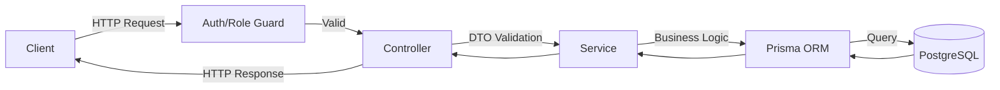
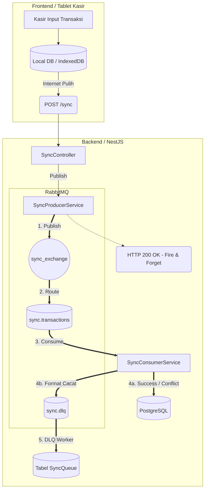

# K-POS Backend Architecture & Design Justifications

Dokumen ini menjelaskan arsitektur backend K-POS untuk menangani skenario **Offline-First Transaction Consistency** dan **Strict Immutability**.

## 1. Arsitektur Keseluruhan (High-Level)

Sistem K-POS dibangun menggunakan framework **NestJS** dengan pendekatan *Modular Architecture*. Backend ini menyediakan layanan berbasis **REST API** yang diakses oleh dua jenis *client*:
1. **Aplikasi Tablet Kasir (Frontend)**: Beroperasi secara *offline-first*.
2. **Dashboard Web K-POS**: Digunakan oleh Owner/Admin untuk manajemen *inventory* dan rekonsiliasi keuangan.

### Tech Stack Utama
- **Framework:** NestJS (Node.js/TypeScript)
- **Database:** PostgreSQL
- **ORM:** Prisma
- **Message Broker:** RabbitMQ (CloudAMQP)
- **Authentication:** JWT (JSON Web Tokens) dengan skema *Access Token* & *Refresh Token*.
- **Storage:** Supabase Storage (untuk gambar produk).

---

## 2. Standard REST API Flow (Online Operations)

Untuk fitur-fitur standar seperti manajemen produk, autentikasi, dan *dashboard reporting*, K-POS menggunakan arsitektur REST API sinkronus (*Request-Response* klasik).

### Keamanan (Authentication & Authorization)
- **JWT Strategy:** Setiap *request* yang dilindungi wajib menyertakan `Authorization: Bearer <token>`.
- **Role-Based Access Control (RBAC):** Diatur menggunakan *decorator* `@Roles(Role.OWNER, Role.ADMIN)`. Kasir (Operator) tidak dapat mengakses rute manajemen produk maupun rekonsiliasi.

---

## 3. Offline-First Pipeline (Asynchronous Transactions)

Untuk mengakomodasi Kasir yang tetap berjualan tanpa internet, sinkronisasi transaksi tidak menggunakan HTTP *Request-Response* biasa, melainkan menggunakan arsitektur **Event-Driven / Message Queue** untuk mencegah kelebihan beban server (*Thundering Herd Problem*).

### Justifikasi Penggunaan RabbitMQ vs Sinkronisasi Langsung
- **Problem:** Jika 300 *device* *online* bersamaan dan menembakkan 4.500 transaksi langsung ke PostgreSQL (Sync Sinkronus), koneksi *database pool* akan habis (*Connection Timeout*) dan transaksi gagal.
- **Solution & Justification:** RabbitMQ bertindak sebagai "Penyangga" (*Buffer*). `POST /sync` hanya menaruh data ke memori RabbitMQ lalu langsung mengembalikan `200 OK`. *Worker* PostgreSQL akan menarik dan memproses pesan tersebut satu per satu dengan kecepatan stabil tanpa pernah membebani *database* (Resilience tinggi).

---

## 4. Integritas Data & Concurrency Control

### A. Idempotensi Berbasis UUID Lokal
- **Kasus:** Kasir mengirim transaksi yang sama dua kali karena jaringan tidak stabil (*Retry*).
- **Solusi:** Transaksi dari FE membawa `offline_uuid`. Backend menjadikan `id_device` + `offline_uuid` sebagai *Unique Constraint*. Jika terdeteksi duplikat, *Worker* akan menolak memproses ulang dan langsung me-*acknowledge* pesan tersebut.

### B. Pessimistic Locking (Menghindari Race Condition)
- **Kasus:** Dua kasir menjual barang yang sama persis saat stok tersisa 1, lalu keduanya melakukan *sync* di waktu bersamaan.
- **Solusi:** Di dalam `SyncConsumerService`, validasi dan pemotongan stok dilakukan di dalam transaksi database (`$transaction`) dengan *Pessimistic Locking* menggunakan SQL Raw: `SELECT ... FOR UPDATE`. Ini mengunci baris stok tersebut di PostgreSQL hingga struk pertama selesai diproses.

---

## 5. Rekonsiliasi & Exception Workflow (Strict Immutability)

Dalam sistem finansial, data yang sudah terekam sah tidak boleh dihapus begitu saja.

### A. Penanganan Konflik Stok (SYNC_CONFLICT)
Jika stok habis saat Sinkronisasi:
- Transaksi **tetap masuk** ke tabel `Transaction` dengan status `SYNC_CONFLICT`. (Karena secara fisik, kasir sudah menerima uang dari pelanggan).
- Owner harus membuka halaman Rekonsiliasi dan secara manual menekan tombol **Confirm** atau **Void**.

### B. Strict Immutability (Append-Only Corrections)
Jika transaksi yang sudah berstatus `CONFIRMED` terbukti salah (kasir salah input / pelanggan melakukan retur):
1. Sistem **tidak akan** melakukan `UPDATE` atau `DELETE` pada baris transaksi asli. Statusnya akan tetap `CONFIRMED` selamanya sebagai bukti historis.
2. Sistem menjalankan *Exception Workflow* (*Append-Only*):
   - Jika **Void Total** (misal penipuan): Backend membuat 1 baris di tabel `TransactionCorrection` untuk mencatat pembatalannya.
   - Jika **Revisi** (misal salah jumlah barang): Backend membuat 1 Transaksi Baru yang benar, lalu menyambungkannya ke transaksi lama lewat tabel `TransactionCorrection` (*Immutable Bridge*).
3. Di sisi Frontend / Dashboard, transaksi asli akan disembunyikan dari perhitungan pendapatan karena ID-nya sudah tercatat sebagai transaksi "Dibatalkan/Dikoreksi" di tabel `TransactionCorrection`. Jejak audit 100% sempurna tanpa ada *log* yang menguap.
