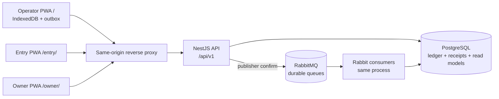

# K-POS System Architecture

## Context

K-POS memakai modular monolith agar transactional boundary tetap sederhana. Tiga PWA dipisah karena access pattern berbeda, bukan karena setiap UI membutuhkan backend sendiri.



Local ports: Operator `5173`, Entry `5174`, Owner `5175`, API `3001`, PostgreSQL `5432`, RabbitMQ `5672`, management UI `15672`.

## Backend modules

| Module               | Ownership                                                                    |
| -------------------- | ---------------------------------------------------------------------------- |
| Auth/Sessions        | credentials, access token, rotating refresh, offline lease, revocation       |
| Merchants/Users      | onboarding, exactly-one Owner, Entry/Operator management                     |
| Devices              | shared counter pairing, binding, revoke, last Operator lease                 |
| Products/Inventory   | catalog snapshots, archive, adjustment, stock movements                      |
| Sync/Receipts        | validation, payload hash, durable receipts, publish dispatcher, status query |
| Transactions         | immutable ledger, item/payment snapshot, effective status                    |
| Reconciliation       | conflict resolution, payment exception, correction, retry approval           |
| Reporting            | read-model query; write projection dijalankan worker lane                    |
| Audit/Health/Metrics | forensic trail, dependency state, operational telemetry                      |

## Durable sync path

```mermaid
sequenceDiagram
    participant PWA as Operator PWA
    participant API as Nest API
    participant DB as PostgreSQL
    participant MQ as RabbitMQ
    participant W as Consumer

    PWA->>PWA: Atomic transaction + outbox
    PWA->>API: POST /api/v1/sync + X-Device-ID
    API->>API: Validate whole batch + canonical hash
    API->>DB: Create/reuse receipts atomically
    API->>MQ: Persistent publish with confirm
    alt confirmed publish
        API-->>PWA: 200 accepted + queued_at
    else broker unavailable
        API-->>PWA: 503 retryable; receipts retained
        API->>MQ: Dispatcher retries unpublished receipts
    end
    MQ->>W: Deliver message
    W->>DB: Idempotent ledger transaction
    DB-->>W: Commit
    W-->>MQ: ACK
    PWA->>API: GET /sync/receipts?offline_uuid=...
    API-->>PWA: QUEUED/PROCESSING/SYNCED/CONFLICT/FAILED
```

API tidak melakukan distributed transaction antara PostgreSQL dan RabbitMQ. Durable receipt + publish state bertindak sebagai transactional outbox. Crash setelah DB commit tetapi sebelum publish-confirm bookkeeping aman karena dispatcher dapat publish ulang dan consumer idempotent.

## Idempotency dan concurrency

- Key: unique `(device_id, offline_uuid)`.
- Identity: UUID v4/v7 accepted; frontend harus mempertahankan UUID yang sama pada retry.
- Integrity: canonical payload hash dihitung dari normalized immutable sale payload.
- Identical replay mengembalikan existing receipt/status.
- Different payload pada key sama menolak seluruh request `409`.
- Product ownership dan device-to-merchant binding diverifikasi sebelum enqueue.
- Stock write menggunakan database transaction/row lock dan idempotent movement key.

## Worker lanes

Satu process boleh menjalankan beberapa consumer loop independen:

1. Sync settlement: receipt → immutable ledger/payment.
2. Inventory: confirmed sale/correction → stock movement/discrepancy.
3. Reporting: confirmed effective effect → daily/product projections.
4. DLQ: terminal broker failure → `FAILED` receipt.

Lane dipisahkan queue, consumer concurrency, dan metric agar reporting backlog tidak memblokir settlement. PostgreSQL outbox fan-out memungkinkan inventory/reporting replay tanpa menulis ulang transaction.

## Consistency boundary

| Data                     | Model                                   |
| ------------------------ | --------------------------------------- |
| Local checkout/outbox    | Strong atomicity di IndexedDB           |
| Backend receipt creation | Strong atomicity di PostgreSQL          |
| Rabbit delivery          | At-least-once                           |
| Ledger effect            | Exactly-once melalui idempotency        |
| Inventory                | Eventual, idempotent                    |
| Reporting                | Eventual, idempotent, freshness visible |

## Hosted routing dan service worker

- `/api/v1`, `/health`, `/metrics` → NestJS.
- `/entry/` → Entry static PWA.
- `/owner/` → Owner static PWA.
- `/` → Operator static PWA.

Operator service worker mengecualikan `/entry/`, `/owner/`, `/api/`, `/health`, dan `/metrics`. Entry dan Owner memakai base path serta service-worker scope masing-masing. Unknown API route tidak boleh menerima SPA HTML.

## Failure behavior

| Failure                                | Behavior                                                  |
| -------------------------------------- | --------------------------------------------------------- |
| Browser/network down                   | Checkout lokal lanjut selama lease valid; outbox retained |
| Lost HTTP response                     | Retry same ID/payload; existing receipt reused            |
| Rabbit unavailable                     | API degraded; sync `503`; REST sehat tetap melayani       |
| Consumer crash before commit           | Message redelivered, belum ada effect                     |
| Consumer crash after commit before ACK | Redelivery becomes idempotent no-op                       |
| Transient DB/provider error            | TTL retries 5/30/120 detik                                |
| Permanent error                        | DLQ and terminal `FAILED`                                 |
| Stock shortage                         | Terminal `CONFLICT`; Owner confirm/void                   |
| Reporting backlog                      | Sale tetap settled; dashboard menunjukkan lag             |

Keputusan utama dijelaskan di [ADR index](adr/README.md), schema di [database design](database_design.md), dan operasi di [deployment runbook](deployment_runbook.md).
