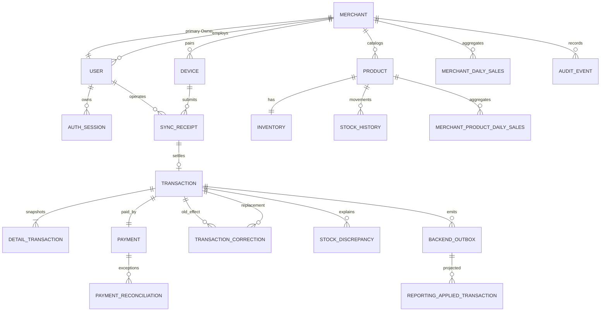

# Database Design

PostgreSQL adalah source of truth untuk identity, durable sync receipts, immutable ledger, outbox, inventory movements, reconciliation, audit, dan reporting projections. RabbitMQ hanya delivery infrastructure.

## ERD konseptual

## Critical constraints

- `user.role IN ('OWNER','ENTRY','OPERATOR')`.
- Exactly one active primary Owner per merchant ditegakkan dengan partial unique index atau equivalent transactional constraint.
- User email globally unique atau normalized merchant-scoped key sesuai final migration; login lookup tidak boleh ambiguous.
- Product SKU unique per merchant.
- Sync receipt unique `(id_device, offline_uuid)` dan menyimpan canonical payload hash/payload.
- Transaction references exactly one receipt; original confirmed transaction immutable melalui service policy + DB permission/trigger bila diperlukan.
- Stock movement, correction application, dan reporting application memiliki unique idempotency key.
- Money memakai integer rupiah; quantity positif untuk sale item; arithmetic divalidasi sebelum receipt.

## Core table purpose

| Table                            | Purpose                                                                  |
| -------------------------------- | ------------------------------------------------------------------------ |
| `merchants`                      | Tenant, timezone, lifecycle                                              |
| `users`                          | Merchant identity dan one-of-three role                                  |
| `auth_sessions`                  | Hashed rotating refresh token family, expiry, revoke/reuse metadata      |
| `devices`                        | Shared counter binding, pairing/revocation state                         |
| `products` / `inventories`       | Current catalog/current stock, bukan historical sale truth               |
| `sync_receipts`                  | Durable enqueue/status/publish state, payload hash, error classification |
| `transactions`                   | Canonical append-only sale header                                        |
| `detail_transactions`            | Product/name/SKU/price/version snapshot                                  |
| `payments`                       | Method/reference snapshot dengan status VERIFIED atau FAILED             |
| `payment_reconciliations`        | Exception case, evidence, resolution, Owner, dan correction reference    |
| `transaction_corrections`        | Append-only void/replacement relation dan reason                         |
| `stock_histories`                | Idempotent stock movement ledger                                         |
| `stock_discrepancies`            | Negative-stock/conflict resolution evidence                              |
| `backend_outbox`                 | Durable inventory/reporting event fan-out                                |
| `reporting_applied_transactions` | Projection replay guard                                                  |
| `merchant_daily_sales`           | Merchant/date aggregate                                                  |
| `merchant_product_daily_sales`   | Merchant/product/date aggregate                                          |
| `audit_events`                   | Privileged action trail tanpa secret                                     |

## Transaction boundaries

1. Owner registration: merchant + primary Owner + audit.
2. Sync accept: validate outside/inside as appropriate, then receipts/publish-intent atomically.
3. Settlement: claim receipt + ledger/item/payment + outbox events + receipt status, one commit.
4. Conflict confirm: resolution + stock effect/discrepancy + ledger/outbox, idempotent one commit.
5. Invalid payment resolution: reconciliation + failed payment + correction/void + outbox, one commit.
6. Correction: correction/replacement + outbox effect, one commit.
7. Projection: claim outbox/application guard + aggregate upsert, one commit.

## Indexes

- Due unpublished receipt `(publish_status, next_attempt_at)`.
- Due outbox `(status, available_at)`.
- Receipt lookup `(id_device, offline_uuid)` unique dan `(id_merchant, status, updated_at)`.
- Transaction merchant timeline `(id_merchant, created_at DESC, id_transaction)`.
- Payment reconciliation exceptions `(id_merchant, status, updated_at)`.
- Reporting `(id_merchant, sale_date)` dan `(id_merchant, id_product, sale_date)`.
- Audit cursor `(id_merchant, created_at DESC, id_audit_event)`.

Clean reset masih diizinkan sebelum production data. Setelah customer data live, migration harus additive, reviewed, backup-aware, dan rollback/forward-fix plan wajib ada.
