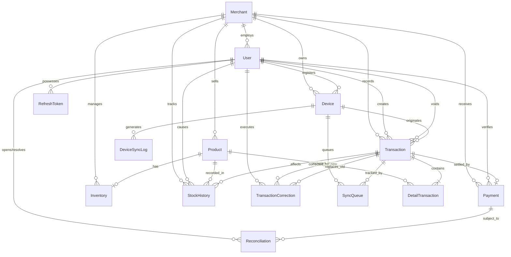

# Database Design (ERD)

Dokumen ini menjelaskan struktur basis data relasional (PostgreSQL) untuk K-POS, yang dirancang untuk mendukung skenario sinkronisasi *offline-first* dan integritas data finansial.

## a. Entity-Relationship Diagram

Diagram berikut memvisualisasikan seluruh entitas pada sistem K-POS beserta relasi antar-entitasnya.

## b. Table Descriptions & Purposes

| Nama Tabel | Deskripsi & Tujuan |
|---|---|
| **User** | Menyimpan profil pengguna dengan tiga peran: `OWNER`, `OPERATOR`, dan `ENTRY`. Digunakan untuk otentikasi (login) dan otorisasi (*Role-Based Access Control*). |
| **Merchant** | Tabel pusat yang merepresentasikan entitas bisnis. Semua entitas operasional berelasi ke tabel ini untuk pemisahan data (*multi-tenancy*). |
| **Device** | Mencatat perangkat yang terdaftar ke dalam sistem dan dipasangkan ke `Merchant` dan `User`. Digunakan untuk mekanisme *pairing* (`pairing_code`), penelusuran asal transaksi *offline*, dan manajemen status (`UNPAIRED`, `PAIRED`, `REVOKED`). |
| **DeviceSyncLog** | Menyimpan riwayat eksekusi sinkronisasi perangkat. Berguna untuk *monitoring* dan *observability*. |
| **Product** | Katalog barang yang dijual oleh `Merchant`, mencakup SKU, nama, dan harga. |
| **Inventory** | Menyimpan kuantitas stok saat ini dengan relasi *1-to-1* ke `Product`. Dipisahkan dari `Product` untuk menghindari *lock contention* saat pembaruan stok bersamaan. |
| **StockHistory** | Log mutasi stok yang bersifat *append-only*. Setiap perubahan pada `Inventory` menghasilkan satu baris baru di tabel ini sebagai jejak audit. |
| **Transaction** | Entitas inti yang merepresentasikan satu *header* transaksi penjualan. Melacak status transaksi (`PENDING`, `CONFIRMED`, `VOIDED`, `FAILED`), status sinkronisasi, dan `offline_uuid` dari perangkat asal untuk *idempotency*. |
| **DetailTransaction** | Memuat baris barang (*line items*) dari sebuah transaksi. Menyimpan snapshot `product_name`, `unit_price`, dan `sku_snapshot` pada saat transaksi terjadi agar nilai historis tidak berubah. |
| **Payment** | Catatan penyelesaian pembayaran dari sebuah transaksi, mencakup metode pembayaran (`CASH`, `STATIC_QRIS`, `BANK_TRANSFER`), referensi transfer, nilai kembalian, dan status verifikasi (`VERIFIED` atau `FAILED`). |
| **TransactionCorrection** | Mencatat relasi antara transaksi lama (`id_old_transaction`) yang digantikan oleh transaksi koreksi baru (`id_new_transaction`), beserta `corrected_by` dan `reason`. |
| **SyncQueue** | Merekam *payload* sinkronisasi *offline* beserta status prosesnya (`PENDING_SYNC`, `SYNCING`, `SYNCED`, `SYNC_FAILED`, `SYNC_CONFLICT`), jumlah percobaan ulang (`retry_count`), dan log *error* terakhir. |
| **RefreshToken** | Menyimpan token sesi untuk manajemen autentikasi berkelanjutan di sisi klien. |
| **Reconciliation** | Sarana investigasi ketidakcocokan nilai pembayaran. Dapat dibuka oleh `User` (`opened_by`) dan diselesaikan oleh `User` lain (`resolved_by`), dengan status `OPEN`, `RESOLVED_VALID`, atau `RESOLVED_INVALID`. |

## c. Key Indexes or Constraints

1. **Unique Constraints:**
   - `User.email`: Mencegah duplikasi akun.
   - `Product.(id_merchant, sku)`: SKU unik per merchant.
   - `Device.pairing_code`: Kode pairing unik per perangkat.
   - `Device.(id_merchant, device_id_hash)`: Mencegah satu perangkat fisik diregistrasi lebih dari sekali ke merchant yang sama.
   - `Transaction.(id_device, offline_uuid)`: *Idempotency key*. Mencegah duplikasi transaksi jika terjadi *network retry* saat sinkronisasi.
   - `Payment.id_transaction`: Satu transaksi hanya memiliki satu catatan pembayaran.
   - `TransactionCorrection.id_new_transaction`: Satu transaksi koreksi hanya bisa menggantikan satu transaksi lama.

2. **Foreign Key & Referential Integrity:**
   - *Cascade Delete*: Menghapus `Merchant` akan otomatis menghapus `Device`, `Product`, `Inventory`, `Transaction`, dan `Payment` terkait.
   - *Restrict*: `User` yang sudah memiliki `Transaction` atau `Payment` tidak dapat dihapus.
   - *SetNull*: Referensi `id_user` dan `id_merchant` pada `StockHistory` akan di-set `NULL` jika `User`/`Merchant` terkait dihapus, sehingga log audit tetap ada.

3. **Indexes:**
   - Indeks dipasang pada setiap *foreign key* yang sering digunakan sebagai filter (`id_merchant`, `id_user`, `id_device`, `id_transaction`).
   - Kolom temporal (`created_at`, `date`, `confirmed_at`) dan kolom status (`status`, `sync_status`) juga di-indeks untuk mendukung operasi filter dan *reporting*.

## d. Notes on Normalization

Skema ini dinormalisasi hingga **3NF**, dengan beberapa *denormalization* yang disengaja:

1. **Pemisahan `Inventory` dari `Product` (3NF):** Kuantitas stok disimpan di tabel terpisah agar pembaruan stok tidak memblokir pembacaan data produk.

2. **Snapshot di `DetailTransaction`:** Kolom `product_name`, `unit_price`, dan `sku_snapshot` disalin dari `Product` pada saat transaksi terjadi. Tujuannya agar nilai historis tidak berubah meskipun data `Product` diperbarui di kemudian hari.

3. **Append-Only di `StockHistory`:** Setiap mutasi stok dicatat sebagai baris baru, bukan menimpa baris lama. Pembatalan transaksi dilakukan dengan membuat entitas `TransactionCorrection` baru, bukan menghapus data yang sudah ada.
