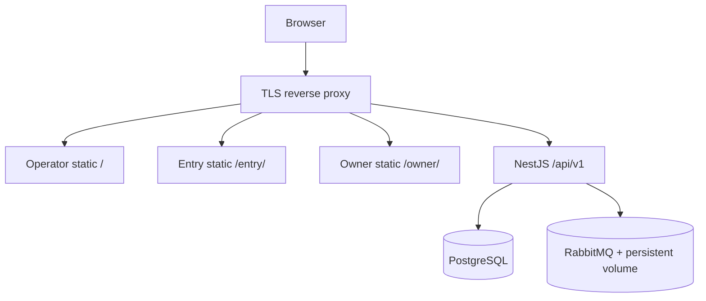

# Deployment and Operations Runbook

## Topology

Hosted demo mempertahankan biaya rendah:

- satu reverse proxy/static host untuk tiga PWA;
- satu NestJS API process yang juga menjalankan Rabbit consumers;
- satu PostgreSQL;
- satu RabbitMQ dengan persistent volume.

Production recommendation boleh memisahkan static CDN/API/worker deployment, memakai managed PostgreSQL/RabbitMQ, backup/PITR, secret manager, dan independent autoscaling. Contract tidak bergantung pada demo topology.

## Environment groups

- Identity/security: database URL, access/refresh/offline-lease signing secrets, cookie domain/secure mode, CORS origins.
- Rabbit: URL, exchange/queue names, prefetch, publisher timeout, retry delays.
- Runtime: port, log level, graceful shutdown timeout, trusted proxy.
- Limits: sync batch max, rate limits, pool size/timeouts.
- Frontend origins/paths untuk same-origin routing.

Default supported profile memakai `DATABASE_POOL_MAX=32`, `RABBITMQ_PREFETCH=8`, dan reporting concurrency 4. Satu replica dapat memakai sampai 32 koneksi; budget cluster minimum adalah `(jumlah replica × 32) + koneksi migration/operasional + safety margin`. Jangan scale replica sebelum mengecek `max_connections`, pool wait, dan workload mix.

`.env` dan secrets tidak boleh di-commit. Production secret harus unique per environment dan dapat dirotasi.

## Local bring-up

1. Start PostgreSQL dan RabbitMQ via Docker Compose.
2. Verifikasi exact database name/host sebelum migration/reset.
3. Install dependency dari lockfile.
4. Jalankan clean migration/seed hanya pada local or isolated test database.
5. Start Nest API/consumer, lalu tiga frontend ports.
6. Cek `/health`, Rabbit management, login tiga role, sync smoke, dan reporting convergence.

## Deployment sequence

1. Backup dan verify restore point bila environment memiliki data.
2. Apply backward-compatible migration sebelum application cutover.
3. Deploy API/consumer dengan health/readiness gate.
4. Verify DB/Rabbit connectivity dan queue bindings.
5. Deploy PWAs yang pin OpenAPI-compatible backend.
6. Smoke auth, enqueue, receipt poll, settlement, inventory, dan dashboard.
7. Monitor error rate, oldest receipt age, retry/DLQ depth, pool wait, dan projection lag.

Clean reset hanya untuk prototype/test sebelum customer data. Production migration harus additive dan menggunakan expand/migrate/contract bila perlu.

## Health semantics

- `healthy`: API, DB, Rabbit, dan projections dalam budget.
- `degraded`: API/DB hidup tetapi Rabbit atau reporting tertinggal; non-dependent routes tetap melayani.
- `unhealthy`: API tidak dapat memenuhi core identity/ledger read/write karena DB/runtime failure.

Readiness tidak boleh menjatuhkan entire API hanya karena reporting lag. Sync harus memberi error retryable yang machine-readable bila broker path belum durable.

## Incident playbooks

### Rabbit unavailable

1. Confirm PostgreSQL/API health dan tandai degraded.
2. Jangan purge queue/receipt.
3. Restore Rabbit/volume/binding.
4. Verify dispatcher publishes pending receipts.
5. Observe retry/DLQ and settlement convergence; sample idempotency audit.

### DLQ growth

1. Pause owner retry storm dan inspect classified errors/redacted payload metadata.
2. Fix root cause or mark permanent.
3. Retry only eligible receipt via controlled Owner/API operation.
4. Verify one ledger effect and terminal receipt.

### Reporting lag

1. Core settlement tetap aktif.
2. Check outbox depth, projection consumer, DB pool wait/indexes.
3. Replay idempotently setelah recovery.
4. Compare projections dengan canonical effective ledger.

### Suspected duplicate/lost sale

1. Correlate device ID + offline UUID + payload hash + receipt ID.
2. Inspect receipt publish/consumer attempts dan transaction/outbox/application guards.
3. Jangan edit ledger manually; gunakan controlled correction/replay.
4. Record incident and add regression test.

## Backup dan teardown

Production memerlukan encrypted backup/PITR dan scheduled restore drill. Menghapus sandbox berarti menghapus app resources, PostgreSQL volume/database, Rabbit persistent volume, dan secrets setelah evidence/export yang diperlukan disimpan. Jangan menyebut demo sebagai production-ready tanpa capacity, security, accessibility, backup, restore, and incident evidence.
