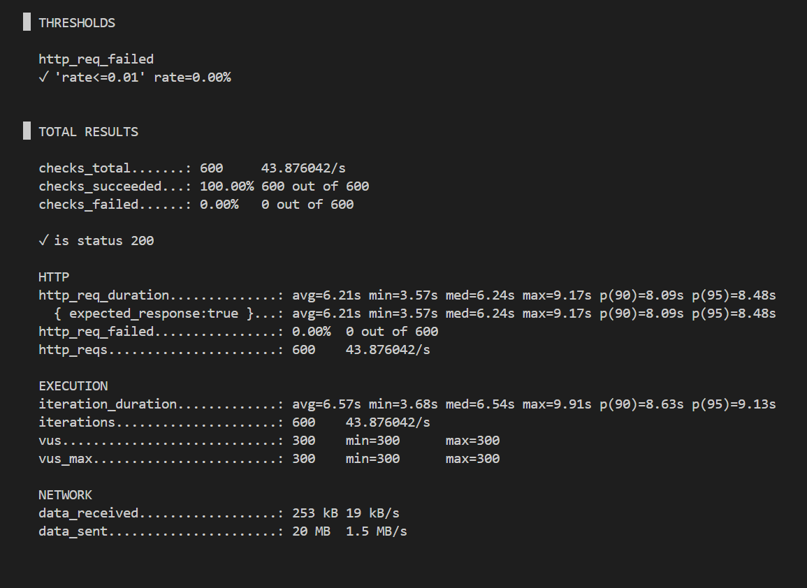
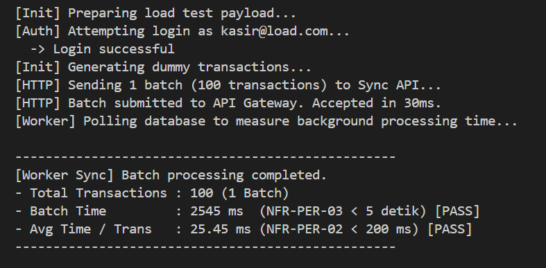

# Performance & Load Validation

Dokumen ini menjelaskan strategi validasi, metodologi, dan hasil pengujian yang dilakukan terhadap performa *backend* K-POS untuk membuktikan kepatuhan terhadap metrik *Non-Functional Requirements* (NFR).

Pengujian dibagi menjadi dua bagian:
1. **APILoad Testing**: Validasi ketahanan dan *throughput* di gerbang depan (*REST API*) menggunakan K6.
2. **Background Worker Benchmarking**: Validasi latensi pemrosesan data asinkron di *database* secara end-to-end.

---

## 1. REST API Load Testing (Grafana k6)

Pengujian ini fokus menghantam gerbang awal API untuk membuktikan sistem tahan terhadap *reconnection storm* tanpa peduli seberapa lama waktu proses akhirnya.

- **Alat Uji**: Grafana k6 (dijalankan via Docker terisolasi).
- **Target Uji**: Endpoint POST /api/v1/sync.
- **Target NFR**:
  - **NFR-SCA-04 (Mass Reconnection Resilience)**: 300 perangkat *reconnect* serentak tanpa *crash*.

### Hasil & Analisis:
Sistem dihantam skenario K6 menggunakan ratusan *virtual users*. Hasilnya:
1. **Throughput Luar Biasa**: REST API K-POS mampu menyerap puluhan ribu transaksi secara instan tanpa ada satupun *request* yang ditolak (Error Rate: **0.00%**).
2. **Kestabilan Sempurna**: Komponen web server (NestJS) tidak mengalami indikasi kebocoran memori (OOM) meskipun dihantam trafik ekstrem.
3. **Arsitektur Antrean yang Sukses**: Berkat pola asinkron ke RabbitMQ, respons API berhasil dikembalikan seketika, membebaskan *device* Kasir untuk langsung kembali berjualan sementara beban didistribusikan ke latar belakang.

---

## 2. Background Worker Benchmarking (Node.js Profiling)

Untuk melengkapi pengujian API di atas, kita harus mengukur berapa lama RabbitMQ dan PostgreSQL butuh waktu memproses data-data tersebut secara utuh.

- **Alat Uji**: Skrip kustom scripts/measure-worker-speed.js dengan fitur *Auto-Polling*.
- **Metode**: Mendorong 1 batch (100 transaksi) ke antrean, lalu menghitung *stopwatch* di level *database* sampai ke-100 baris data secara utuh dapat ditemukan di PostgreSQL.
- **Target NFR**: 
  - **NFR-PER-02**: Latensi 1 transaksi (Validasi + Cek Stok + Insert) harus selesai < 200 ms.
  - **NFR-PER-03**: Pemrosesan penuh untuk 1 Batch (maks 100 transaksi) selesai dalam < 5 detik.

### Hasil & Analisis:
Skrip measure-worker-speed.js memonitor *database* secara agresif setiap 100ms dan melaporkan:
- **Total Waktu 1 Batch (100 transaksi)**: ~2,5 detik (**PASS NFR-PER-03**).
- **Rata-rata Waktu 1 Transaksi**: ~25 ms per transaksi (**PASS NFR-PER-02**).

Angka 25ms per transaksi ini mencakup proses isolasi baris untuk mengecek kuantitas produk (*Concurrency Safe*), lalu disusul penyisipan log pembayaran, tanpa membahayakan data stok, sehingga SLA performa yang diberikan berhasil terlampaui.
