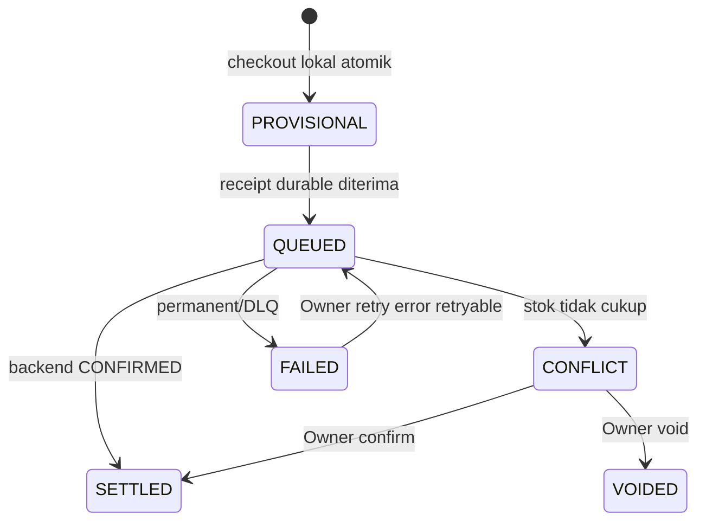

# K-POS Project Overview

K-POS adalah platform point-of-sale multi-tenant untuk merchant yang harus tetap berjualan saat internet tidak stabil. Produk dibagi menjadi tiga PWA sesuai access pattern, tetapi memakai satu backend modular, satu PostgreSQL, dan RabbitMQ untuk settlement asynchronous.

> Status dokumen: **canonical implemented contract** pada branch integration. Bukti dan gate tersisa dicatat di [implementation plan](implementation_plan.md).

## Product promise

Operator dapat menyelesaikan checkout secara lokal tanpa network round-trip. Saat koneksi kembali, transaksi dikirim setidaknya sekali, diproses secara durable, dan menghasilkan business effect tepat sekali. Owner mendapat visibility atas conflict, payment exception, audit, dan reporting tanpa membuat checkout bergantung pada workload analitik.

## Actor dan aplikasi

| Role       | Aplikasi            | Tanggung jawab                                                                            |
| ---------- | ------------------- | ----------------------------------------------------------------------------------------- |
| `OPERATOR` | Operator PWA `/`    | Checkout offline, local receipt, sync status                                              |
| `ENTRY`    | Entry PWA `/entry/` | Catalog, price, image, archive, stock adjustment/history                                  |
| `OWNER`    | Owner PWA `/owner/` | Merchant onboarding, user/device admin, conflict/payment reconciliation, audit, reporting |

Hanya ada tiga role tersebut. Istilah “admin” berarti capability milik `OWNER`, bukan role keempat. Satu merchant memiliki tepat satu active primary Owner. Owner dapat membuat akun `ENTRY` dan `OPERATOR`, tetapi tidak dapat membuat Owner lain lewat public API.

## Core invariants

1. **Offline checkout is local-first.** Transaction, payment snapshot, item snapshot, dan delivery outbox disimpan atomically di IndexedDB sebelum receipt ditampilkan.
2. **At-least-once transport, exactly-once effect.** Retry memakai `(device_id, offline_uuid)` dan canonical payload hash yang stabil.
3. **Queued bukan settled.** HTTP `200` dari sync hanya berarti durable receipt diterima untuk dipublish; client polling sampai `SYNCED`, `CONFLICT`, atau `FAILED`.
4. **Ledger append-only.** Confirmed transaction tidak diedit. Void/correction membuat record baru dan API menghitung effective status.
5. **Inventory eventual.** Stock diterapkan worker setelah settlement; tidak ada cross-device stock reservation.
6. **Payment reconciliation is exceptional.** Payment yang sudah dicek Operator langsung `VERIFIED`; reconciliation record hanya dibuat bila masalah ditemukan kemudian.
7. **Tenant identity server-owned.** Merchant, user, dan device diambil dari authenticated session dan verified device binding, bukan dipercaya dari request body.
8. **Operational path tetap terlindungi.** Reporting, reconciliation, dan Rabbit outage tidak boleh menghentikan login/catalog read yang masih sehat; sync menolak sementara dengan retryable `503` bila durable publish belum tersedia.

## Canonical lifecycle

State di atas adalah **local delivery state**. Canonical ledger memakai original transaction `PENDING` atau `CONFIRMED`; void/correction disimpan append-only dan menghasilkan effective status terpisah.

## Technology boundary

- NestJS API + Rabbit consumer dalam satu process/deployment.
- PostgreSQL sebagai ledger, idempotency store, outbox, dan reporting read-model store.
- RabbitMQ sebagai durable delivery pipeline; bukan source of truth.
- Prisma untuk schema/data access backend.
- React + Vite PWA untuk Operator, Entry, dan Owner.
- OpenAPI snapshot sebagai normative cross-repository contract; wire `snake_case`, frontend domain `camelCase` melalui explicit mapper.

## Repository relationship

- `k-pos-be`: canonical backend, migrations, Rabbit consumers, generated OpenAPI.
- frontend repository: tiga PWA, pinned OpenAPI snapshot, generated client, IndexedDB sync engine.

Urutan perubahan lintas repo adalah backend contract → generated OpenAPI → pinned frontend client → cross-repo E2E. Prototype API frontend lama sudah dihapus setelah NestJS mencapai parity.

## Scope release ini

Termasuk auth/session/offline lease, shared device pairing, offline transaction sync, durable receipts, retry/DLQ, conflict resolution, append-only correction, payment exception reconciliation, product/inventory management, audit, dan Owner sales reporting.

Tidak termasuk real-time stock reservation, microservices, read replica, Redis, external AI/business insight, automated payment gateway verification, native mobile app, atau multi-Owner merchant.

## Definition of done

- Tidak ada lost atau duplicate business effect pada retry, lost response, reconnect massal, dan multi-device concurrency.
- Semua valid sync receipt mencapai terminal state dalam acceptance window.
- Role dan tenant isolation berlaku di controller, service, repository, dan test.
- Reporting eventually converge ke canonical ledger dan menunjukkan freshness secara jujur.
- OpenAPI, backend implementation, generated frontend client, docs, dan E2E tidak drift.

Lanjutkan ke [FRD](FRD.md), [NFR](NFR.md), [architecture](architecture.md), dan [API contract](api_contract.md).
