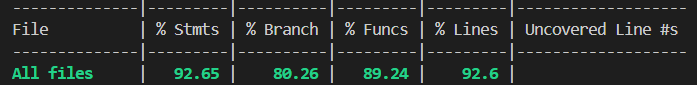

# Testing Strategy & Coverage Plan

Dokumen ini menjelaskan strategi pengujian perangkat lunak untuk K-POS guna menjamin reliabilitas aplikasi, serta menjaga metrik cakupan pengujian (*Test Coverage*).

## a. Unit tests for core functions/services
Setiap layanan inti (*Service*) dan *Controller* diuji menggunakan Jest secara terisolasi. Pengujian ini memastikan logika *state machine* transaksi dan *idempotency* berjalan benar tanpa harus bergantung pada database atau *message broker* nyata. *Mocking* digunakan secara ekstensif dengan `jest.fn()` untuk menggantikan peran Prisma ORM dan dependensi eksternal (seperti RabbitMQ dan Supabase).

Target cakupan pengujian adalah minimal 80% secara keseluruhan. Saat ini, target tersebut telah terlampaui dengan perolehan metrik berupa **Stmts: 92.65%**, **Branch: 80.26%**, **Funcs: 89.24%**, dan **Lines: 92.60%**.

## b. Integration tests for API endpoints and data flows
Fase integrasi bertujuan menguji interaksi nyata antara seluruh sistem, mulai dari endpoint (Controller), validasi, hingga interaksi dengan database lokal. Pengujian ini dijalankan untuk memastikan bahwa seluruh alur berantai, mulai dari registrasi, *login*, manipulasi data master, hingga sinkronisasi transaksi *offline*, berjalan dengan sukses dari ujung ke ujung.

Pengujian dilakukan menggunakan *Supertest* (dalam mode e2e) yang menembakkan HTTP request secara langsung ke API Dev Server pada alamat IPv4 `127.0.0.1`. Penggunaan alamat IP lokal ini diterapkan untuk memastikan kestabilan koneksi dan menghindari isu resolusi DNS `localhost` pada ekosistem Node.js terbaru. Pengujian ini juga menyesuaikan batas pada *Rate Limiter* aplikasi agar tes dapat dieksekusi dengan mulus.

## c. (Optional) Manual test cases or acceptance criteria
Di luar otomatisasi pengujian, aplikasi juga divalidasi performa dan keamanannya secara berkala. **Load Testing:** Membuktikan pemenuhan **NFR-SCA-04** (Kapasitas *mass reconnection* saat 150-300 *device* melakukan *sync* bersamaan dengan ribuan transaksi). Pengujian ini menggunakan **k6 (Grafana)** dengan mengirim ratusan transaksi *sync* secara serentak untuk memvalidasi bahwa arsitektur antrean RabbitMQ efektif menyerap lonjakan lalu lintas (Throttling) tanpa *downtime*.

Selain pengujian performa manual, **Smoke Testing** juga diterapkan sebagai pengamanan (*safeguard*) otomatis di dalam alur *Continuous Integration* (CI). Setiap kali terjadi *Push* atau *Pull Request*, Github Actions akan selalu menjalankan seluruh rangkaian *unit test* dan pengecekan linter untuk mencegah regresi kode sebelum kode disatukan.