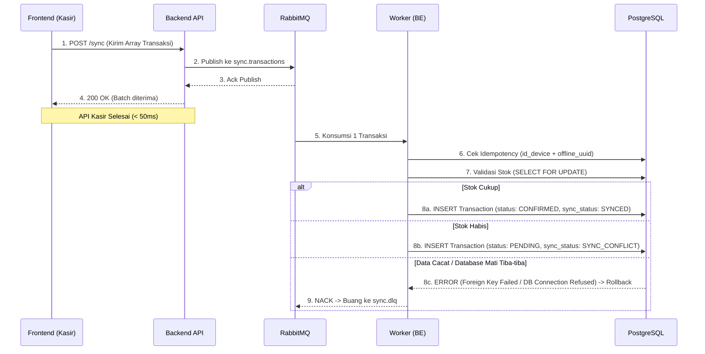

# K-POS User Flows & Reconciliation Lifecycle

Dokumen ini memetakan perjalanan (Journey) pengguna Kasir (Frontend) dan Admin/Owner (Dashboard) dari transaksi offline hingga rekonsiliasi, sesuai dengan arsitektur **Offline-First**.

## 1. Fase 1: Kasir Bertransaksi Offline (Frontend-Only)

Fase ini terjadi saat tidak ada koneksi internet (atau koneksi sangat buruk). Seluruh logika berada di Frontend (Aplikasi Tablet Kasir).

1. **Pembuatan UUID:** Kasir membuat transaksi baru. Sistem FE membuat `offline_uuid` menggunakan algoritma UUID v4.
2. **Checkout:** Kasir menambahkan barang ke keranjang dan memilih metode pembayaran (Cash/QRIS/Transfer).
3. **Konfirmasi Lokal:** Kasir menekan tombol "Bayar".
4. **Penyimpanan Lokal:** FE menyimpan transaksi ke database lokal (IndexedDB / SQLite) dengan status **PROVISIONAL** (yang nanti akan dipetakan menjadi status `PENDING` di sisi *Backend* sebelum akhirnya di-*confirm*). Layar Kasir menampilkan struk dan selesai. Pelanggan pergi membawa barang.

*Tidak ada interaksi dengan Backend (API) di Fase 1 ini.*

## 2. Fase 2: Sinkronisasi Latar Belakang (Internet Pulih)

Begitu koneksi internet terdeteksi (atau berdasarkan interval *cron job* FE), proses sinkronisasi dimulai tanpa disadari oleh Kasir.

### Konfirmasi Akhir FE (Mencegah Infinite Retry)
1. Setelah FE mendapat respons 200 OK dari `POST /sync`, FE **tidak langsung menghapus data lokalnya**.
2. Beberapa saat kemudian, FE menembak `GET /transactions?id_device=DEV-1`.
3. FE mencocokkan `offline_uuid` miliknya dengan response dari Backend.
4. Jika UUID tersebut **ada** (baik `SYNCED` maupun `SYNC_CONFLICT`), FE menghapus/menandai data lokalnya sebagai "SETTLED".
5. Jika UUID tersebut **tidak ada** (karena gagal masuk database akibat *error*), maka status di FE tetap `Provisional` dan FE akan terus mencoba mengirim ulang (sesuai UC-16: *Retry Failed Synchronization*).
6. **Peran DLQ (Dead Letter Queue):** Di sisi Backend, transaksi cacat yang terus-menerus dikirim ulang oleh FE ini akan ditolak oleh *Worker* dan dilempar ke `sync.dlq`. Sebuah *DLQ Worker* akan menangkapnya dan mencatatnya ke tabel `SyncQueue` dengan status `SYNC_FAILED`. Admin/Owner dapat melihat log error ini di Dashboard untuk menginvestigasi mengapa perangkat kasir terus mengirimkan data cacat.

## 3. Fase 3: Resolusi Konflik (Owner Dashboard)

Fase ini dilakukan oleh Pemilik Toko (Owner) melalui *Dashboard Web* K-POS.

1. **Monitoring:** Owner membuka halaman **Rekonsiliasi Transaksi**.
   - FE Dashboard memanggil: `GET /transactions?sync_status=SYNC_CONFLICT`.
2. **Investigasi:** Owner melihat daftar transaksi di mana kasir menerima uang, tapi stok barang tercatat kurang/habis di sistem.
3. **Keputusan Manual:**
   - **Setujui (Resolve - Confirm):** Owner menekan tombol "Confirm". FE menembak `POST /transactions/:id_transaction/resolve` dengan `action: CONFIRM`. Sistem Backend menerima uangnya secara resmi (stok dibiarkan minus atau sudah disesuaikan secara terpisah via fitur Adjustment).
   - **Tolak (Resolve - Void):** Owner menekan tombol "Void". FE menembak API dengan `action: VOID`. Sistem membatalkan transaksi tersebut (uang dianggap tidak masuk, atau kasir disuruh mengembalikan uang/ganti rugi).

## 4. Fase 4: Rekonsiliasi Pembayaran (Payment Reconciliation)

Sesuai aturan *Payment Validation* (FRD.md), validasi pembayaran dibedakan berdasarkan metode:
1. **Tunai (CASH):** Sistem langsung mengubah status *payment* menjadi `VERIFIED` saat sinkronisasi sukses, karena uang dipegang fisik oleh kasir.
2. **Non-Tunai (STATIC_QRIS / BANK_TRANSFER):** Sistem mengatur status *payment* menjadi `PENDING` (*Operator-asserted* / membawa *residual confirmation risk*).

Proses rekonsiliasi dilakukan dengan langkah:
1. Owner membuka daftar transaksi ber-status payment `PENDING`.
2. Owner mengecek mutasi rekening di aplikasi *m-Banking*.
3. **Jika uang terbukti masuk:** Owner menekan "Verifikasi". Status payment menjadi `VERIFIED`.
4. **Jika penipuan (uang tidak masuk):** Owner menekan "Void". Transaksi tersebut dibatalkan (menggunakan *Exception Workflow* / Void).

## 5. Exception Workflow: Void & Correction (Strict Immutability)

*Exception Workflow* adalah alur khusus yang digunakan oleh Owner untuk menangani transaksi yang sudah terlanjur sukses (`CONFIRMED`), namun ternyata bermasalah di kemudian hari (misalnya kasir salah memasukkan barang, atau terbukti ada penipuan pembayaran).

Sesuai aturan **Strict Immutability**, Backend **TIDAK AKAN MENG-UPDATE** atau menghapus baris transaksi asli di tabel `Transaction`. Statusnya akan dibiarkan `CONFIRMED` selamanya. 
Sebagai gantinya, Backend melakukan proses *Append-Only* dengan membuat 1 catatan baru di tabel `TransactionCorrection`. 

*Exception Workflow* terbagi menjadi dua tindakan utama:

### A. VOID (Pembatalan Total)
Digunakan ketika transaksi sepenuhnya batal (contoh: uang transfer ternyata fiktif/penipuan, atau pelanggan mengembalikan semua barang).
1. Owner menekan tombol Void di Dashboard. FE menembak `PATCH /transactions/:id_transaction/void`.
2. Backend membuat entri di `TransactionCorrection`.
3. Kolom `id_new_transaction` dibiarkan **kosong** (`null`), karena tidak ada transaksi pengganti.
4. **Logika Stok:** Jika VOID terjadi karena penipuan/barang dibawa kabur, stok **TIDAK** dikembalikan ke *inventory* (karena wujud fisiknya sudah hilang/menjadi kerugian toko). Namun jika VOID terjadi karena *Refund* (pembeli mengembalikan barang utuh), stok baru dikembalikan (ditambah) ke *inventory*. Uang dicoret dari perhitungan pendapatan.

### B. CORRECTION (Koreksi / Revisi)
Digunakan ketika isi transaksi salah sebagian (contoh: kasir salah pilih varian barang, harga salah input, atau salah jumlah).
1. Owner memperbaiki isi struk di Dashboard. FE menembak `POST /transactions/:id_transaction/correct` dengan daftar barang yang sudah diperbaiki.
2. Backend membuat **satu Transaksi Baru** (dengan ID baru) yang berisi data hasil revisi.
3. Backend membuat entri di `TransactionCorrection`. Kolom `id_old_transaction` diisi ID transaksi yang salah, dan `id_new_transaction` diisi ID transaksi yang baru.
4. Selisih stok antara transaksi lama dan baru disesuaikan secara otomatis oleh sistem.

### Aturan Menampilkan Data (Dashboard & Reporting)
Aplikasi *Dashboard* dan *Reporting (BI)* wajib menyembunyikan/mengabaikan transaksi lama dari perhitungan pendapatan jika ID transaksi tersebut terdaftar di kolom `id_old_transaction` pada tabel `TransactionCorrection`. Dengan arsitektur ini, jejak audit (siapa yang salah input, kapan dikoreksi, dan oleh siapa) tetap 100% terekam sempurna tanpa ada data historis yang dihapus dari *database*.
