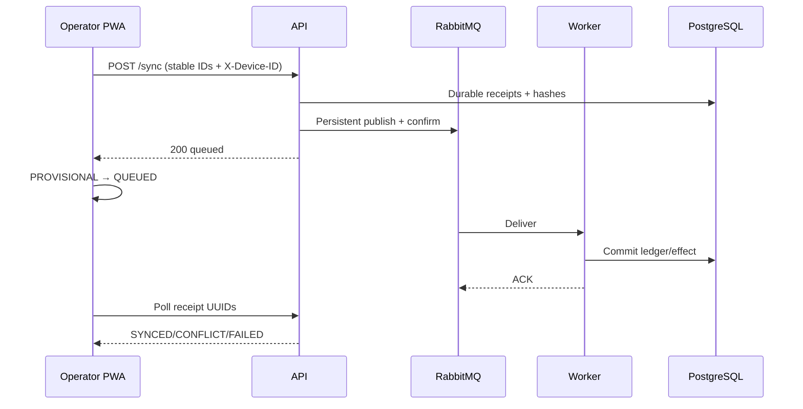

# K-POS User Flows

## 1. Owner onboarding dan staff provisioning

1. Owner mendaftar online dengan merchant name, timezone, email, dan password.
2. Backend membuat merchant + primary Owner dalam satu PostgreSQL transaction.
3. Owner login ke `/owner/`, lalu membuat akun Entry/Operator.
4. Owner membuat shared device pairing code.
5. Device di-pair online; device tidak menjadi milik permanen user pembuatnya.
6. Mutation tercatat di audit tanpa password/pairing secret.

Owner kedua tidak bisa dibuat lewat public API. Recovery/onboarding khusus memakai trusted provisioning CLI.

## 2. Operator login dan offline reopen

1. Operator membuka paired counter dan login online.
2. Backend memverifikasi user aktif, merchant-device binding, dan device tidak revoked.
3. Backend memberi access token 15 menit, rotating refresh cookie, dan signed offline lease tujuh hari.
4. PWA menyimpan access token di memory dan lease melalui secure browser persistence.
5. Setelah browser restart tanpa internet, PWA dapat membuka last Operator session bila signature/binding/expiry valid.
6. Pergantian Operator saat offline ditolak; user harus reconnect dan login.

Logout membersihkan active cart/session setelah konfirmasi, tetapi tidak menghapus catalog cache, confirmed local transactions, receipt history, atau delivery outbox.

## 3. Offline checkout

1. Operator memilih product dari last-known catalog.
2. Cart menghitung integer-rupiah subtotal/total dan payment fields.
3. Confirm sale membuat stable UUID v7 dan immutable item/payment snapshots.
4. Satu IndexedDB transaction menulis sale `PROVISIONAL`, local stock projection, delivery outbox, lalu membersihkan draft.
5. Receipt baru tampil setelah commit sukses.
6. Jika offline, sale tetap queued. Jika online, scheduler mengambil due outbox maksimal 25.

## 4. Reconnect dan settlement

Lost response aman: Operator mengirim ulang exact batch; backend reuse receipt bila hash identik. HTTP queued bukan bukti ledger sudah settled.

## 5. Stock conflict

1. Worker menemukan canonical stock tidak cukup.
2. Transaction/receipt menjadi `CONFLICT`; tidak ada stock movement.
3. Owner membuka conflict queue.
4. **Confirm:** backend mengaplikasikan stock movement tepat sekali, mengizinkan negative stock, membuat discrepancy, dan meng-settle sale.
5. **Void:** backend membuat effective void tanpa stock movement.
6. Operator melihat final state pada polling berikutnya.

## 6. Payment exception

- Cash settled sebagai `VERIFIED`.
- Static QRIS dan transfer mulai sebagai `PENDING` sampai diperiksa Owner.
- Owner memilih `CONFIRM` untuk menjadikannya `RECONCILED`, atau `REJECT` untuk menjadikannya `FAILED`, beserta reason.
- Payment `FAILED` yang perlu membatalkan efek sale dilanjutkan melalui append-only void/correction, bukan edit transaction history.

## 7. Confirmed sale correction

1. Owner membuka effective transaction detail.
2. Untuk full void, backend membuat `TransactionCorrection` tanpa mengubah original confirmed row.
3. Untuk correction, backend membuat replacement transaction dan correction bridge.
4. Inventory event menerapkan delta idempotently.
5. Reporting projection membalikkan effect lama dan menerapkan effect baru once-only.
6. Audit menyimpan actor, reason, timestamp, dan referensi record.

## 8. Entry catalog change saat Operator offline

1. Entry mengubah price atau archive product secara online; catalog version naik.
2. Operator offline tetap memakai snapshot lama.
3. Backend menerima sale lama bila product ID milik merchant dan arithmetic valid.
4. Ledger menyimpan snapshot lama; tidak direprice.
5. Operator refresh catalog pada startup/reconnect/manual refresh.

## 9. Rabbit outage dan recovery

1. API hidup dalam degraded mode; auth/catalog/reporting yang dependensinya sehat tetap berfungsi.
2. Sync yang belum mendapat publisher confirm mengembalikan retryable `503`.
3. Receipt durable yang belum publish dipindai dispatcher.
4. Setelah Rabbit pulih, dispatcher publish; duplicate delivery aman karena consumer idempotent.
5. Tiga transient retries memakai delay 5/30/120 detik; exhaustion masuk DLQ dan receipt `FAILED`.

## 10. Revocation dengan queued sale

User/device revoke mencegah session dan sync baru sesuai policy, tetapi tidak menghapus data lokal. Owner dapat mengaudit dan memulihkan/memindahkan queued sale melalui controlled support flow; data tidak silently discarded.
